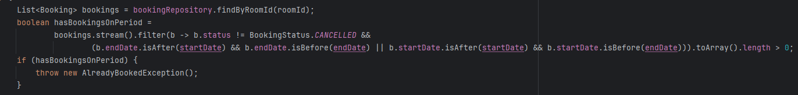
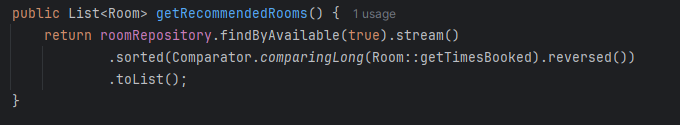
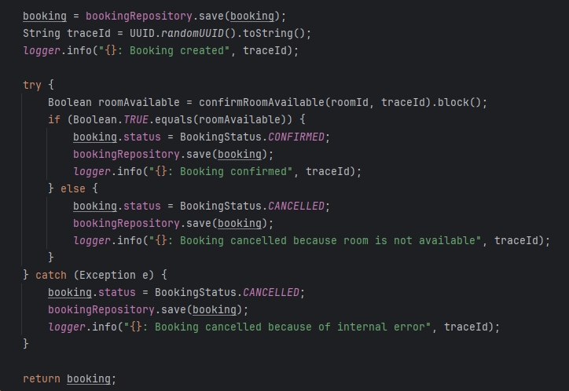
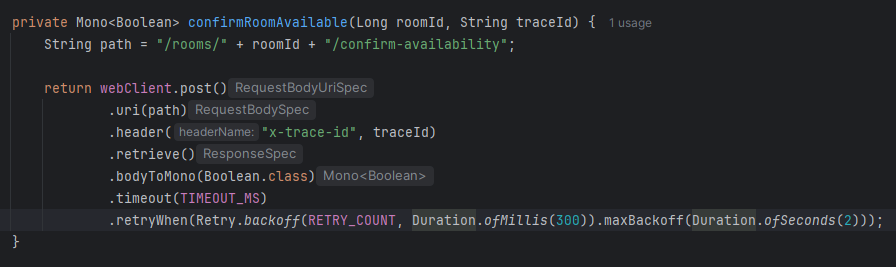
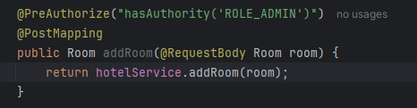
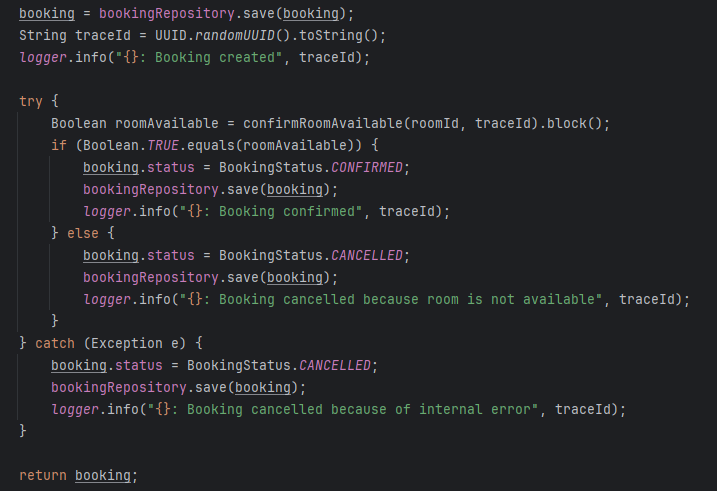
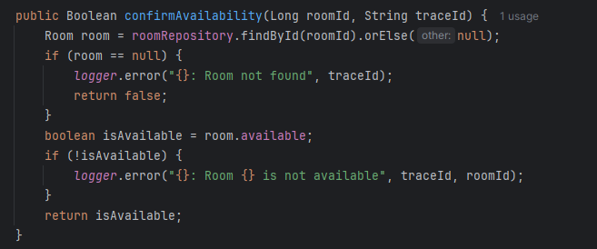

# Итоговый проект "Фреймворк Spring и работа с REST API"

## Запуск

Требования:

- Java
- Maven

```
mvn -pl eureka-server spring-boot:run
mvn -pl api-gateway spring-boot:run
mvn -pl hotel-mgmt-service spring-boot:run
mvn -pl booking-service spring-boot:run
```

## Архитектура

### Api Gateway (api-gateway)

Входная точка приложения. Отвечает за маршрутизацию запросов к соответствующим микросервисам

### Eureka server (eureka-server)

Service Discovery. Регистрирует и отслеживает эндпоинты для обращения к микросервисам.

### Hotel management service (hotel-mgmt-service)

Содержит логику по работе с отелями и номерами.

### Booking service (booking-service)

Содержит логику по работе с бронированиями.

## Детали реализации

### Алгоритм планирования занятости номеров

- Идемпотентность
- Обработка параллельных бронирований
- Корректная работа сервиса под нагрузкой
- Равномерное распределение номеров без простаивания





### Согласованность данных между сервисами

- Saga
- Retry
- Timeout





### [Booking service](booking-service/src/main/java/services/BookingService.java)

- Идемпотентность
- Валидация дат
- Проверка прав доступа
- CRUD бронирований

### [Hotel management service](hotel-mgmt-service/src/main/java/services/HotelService.java)

- Аналитика по загруженности номеров
- Статистика загруженности номеров
- CRUD отелей и номеров

### [Api Gateway](api-gateway/src/main) и [Eureka](eureka-server/src/main)

- Маршрутизация через Gateway
- Интеграция с Eureka для Service Discovery

### Безопасность

- Методная безопасность
- Статусы ошибок
- Проверка ролей
- Каждый сервис валидирует JWT




### Структура баз данных ([booking](booking-service/src/main/java/models), [hotel-mgmt](hotel-mgmt-service/src/main/java/models))

- Дополнительные поля

### Качество кода

- SOLID
- Логика вынесена в сервисы
- DRY, KISS, YAGNI

### Код-стиль

- Короткие методы
- Осмысленные имена
- Соответствие структуры пакетов и архитектуры

### Обработка ошибок

- Единый [ErrorDTO](booking-service/src/main/java/errors)
- Корректные статусы кодов API

### Логирование

- Обработка ключевых событий
- Обработка ошибок
- Корреляция запросов (traceId)





